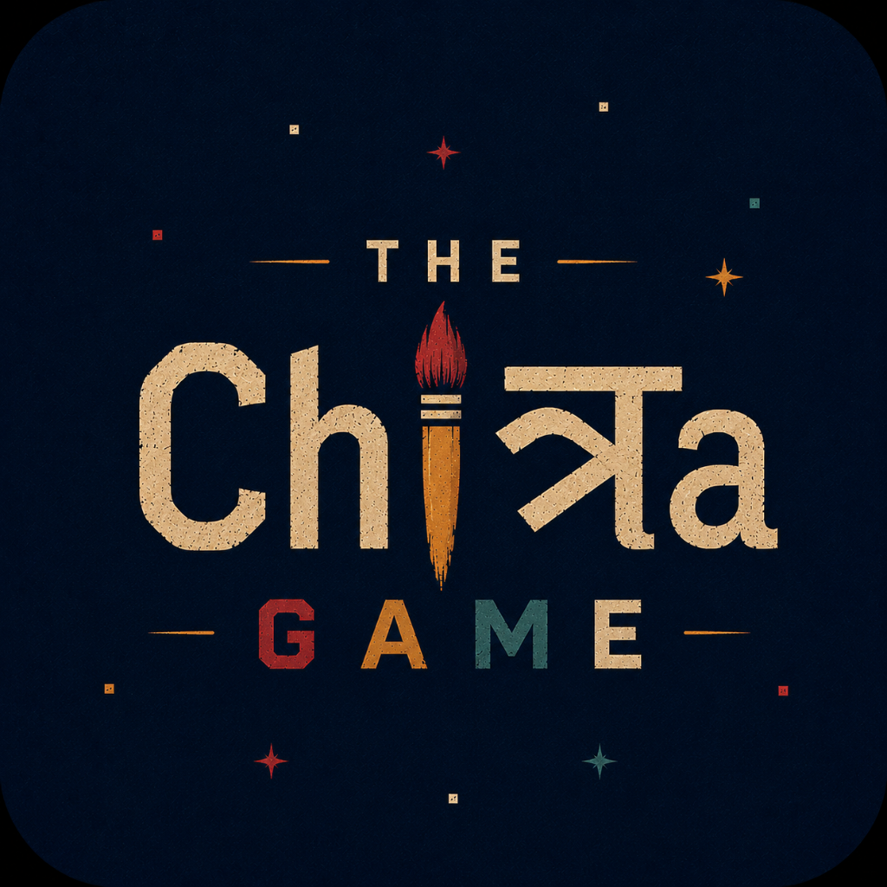

<div align="center">



# 🎨 Chitra Game

### *Draw. Guess. Chaos.*

**A real-time multiplayer draw-and-guess party game built from scratch — think Skribbl.io, but with chaos mode, voice chat, expressive avatars, and categorized word packs.**

[](https://flutter.dev)
[](https://nodejs.org)
[](https://socket.io)
[](https://riverpod.dev)
[](https://firebase.google.com)
[](https://agora.io)
[](LICENSE)

[📱 Download APK](https://github.com/Shalin1204/Chitra_Game/releases/tag/v1.0.0-beta) · [🌐 Play on Web](https://chitra-game.vercel.app) · [🐛 Report Bug](https://github.com/Shalin1204/Chitra_Game/issues) · [✨ Request Feature](https://github.com/Shalin1204/Chitra_Game/issues)

</div>

---

## 📖 Table of Contents

- [What is Chitra Game?](#-what-is-chitra-game)
- [Key Features](#-key-features)
- [Screenshots](#-screenshots)
- [Tech Stack](#-tech-stack)
- [Architecture](#-architecture)
- [Game Loop](#-game-loop)
- [Project Structure](#-project-structure)
- [Word Categories](#-word-categories)
- [Key Engineering Decisions](#-key-engineering-decisions)
- [Getting Started](#-getting-started)
- [Deployment](#-deployment)
- [Roadmap](#-roadmap)
- [Contributing](#-contributing)

---

## ✨ What is Chitra Game?

Chitra Game is a **cross-platform real-time multiplayer drawing party game** built entirely from scratch using Flutter + Node.js. Players join rooms using a 6-character code, take turns drawing a secret word on a shared canvas, and race to guess what others draw — all in real time.

What sets Chitra apart from alternatives:

| Feature | Chitra Game | Typical Alternatives |
|---|---|---|
| Voice Chat | ✅ Agora RTC (low-latency) | ❌ |
| Categorized Words | ✅ 6 categories, 60+ words with context | ❌ Bare word lists |
| Chaos Mode | ✅ Mid-game visual modifiers | ❌ |
| Custom Canvas Engine | ✅ `perfect_freehand` Bézier strokes | Basic path rendering |
| Cross-Platform | ✅ Android, iOS, Web, Desktop | Usually web-only |
| Emoji Avatars + Profiles | ✅ 20 avatars + Firebase high scores | ❌ |
| Private Word Protocol | ✅ Socket-level privacy per drawer | ❌ |

---

## 🚀 Key Features

### 🎨 Advanced Canvas Engine
Strokes are rendered using **`perfect_freehand`** — producing smooth, variable-width Bézier curves that simulate natural brush pressure. Full **Undo/Redo** support. A **draggable chat panel** lets guessers reposition it for a better view of the drawing.

### ⚡ Real-Time Everything
Live drawing strokes, guess chat messages, countdown timers, player join/leave events, and lobby "Ready Up" states all sync **instantly over WebSockets**. The server broadcasts `room_state` updates to all players in sub-100ms.

### 🎙️ Built-in Voice Chat
**Agora RTC Engine** powers low-latency in-game voice rooms — talk and laugh with your friends in real time without leaving the app.

### 🏷️ Categorized Word Packs
Words are displayed with context: *"Food: Sushi"* or *"Movie Character: Deadpool"* — making guessing more fun and fair across 6 themed categories.

### 👽 Expressive Avatars & Profiles
Choose from **20 unique emoji avatars**. All-time High Scores sync securely to your **Firebase profile** — persistent across sessions.

### 🌀 Chaos Mode *(Upcoming)*
Random visual modifiers activate mid-round to shake things up — canvas flips, brush size randomization, color inversions.

---

## 📱 Screenshots

> Screenshots coming soon — deploy the app and capture your best rounds!

---

## 🧰 Tech Stack

### Frontend — Flutter (Cross-Platform)

| Technology | Purpose |
|---|---|
| **Flutter 3** | Cross-platform UI — Android, iOS, Web, Desktop from one codebase |
| **Riverpod 2** | Compile-safe, feature-scoped declarative state management |
| **go_router** | Declarative navigation with deep linking |
| **socket_io_client** | WebSocket client — real-time event bus with the server |
| **perfect_freehand** | Smooth, pressure-sensitive Bézier drawing strokes |
| **flutter_animate** | Micro-animations and UI transitions |
| **Agora RTC Engine** | Low-latency in-game voice chat rooms |
| **firebase_auth / firestore** | Persistent player profiles and High Score storage |
| **shared_preferences** | Local persistence — avatar, display name |
| **freezed + json_serializable** | Immutable data models with type-safe JSON |

### Backend — Node.js

| Technology | Purpose |
|---|---|
| **Node.js 18+** | Server runtime |
| **Socket.IO 4** | WebSocket event bus — room management, canvas relay, scoring |
| **uuid** | Unique room and player ID generation |
| **nodemon** | Hot-reload during development |

---

## ⚡ Architecture

### Real-Time Event Protocol

```
Flutter Client                         Node.js Server
     │                                       │
     │──── join_room ──────────────────────► │  Creates/joins room, assigns player ID
     │◄─── room_state ─────────────────────  │  Broadcasts full state to all players
     │                                       │
     │──── ready_up ───────────────────────► │  Player marks ready
     │◄─── room_state ─────────────────────  │  Updated ready states broadcast
     │                                       │
     │──── start_game (host only) ─────────► │  Validates all ready, begins round 1
     │◄─── word_choices ───────────────────  │  ⚠ Sent ONLY to drawer's socket (private)
     │◄─── room_state ─────────────────────  │  Broadcast (currentWord hidden from all)
     │                                       │
     │──── select_word ────────────────────► │  Drawer picks from 3 choices
     │◄─── timer_update (every second) ────  │  80-second countdown broadcast
     │                                       │
     │──── canvas_stroke ──────────────────► │  Live drawing — relayed to all
     │◄─── canvas_stroke ──────────────────  │  All other players render in real time
     │                                       │
     │──── chat_message ───────────────────► │  Player guess
     │◄─── chat_message (correct!) ────────  │  Server validates, awards points
     │◄─── room_state ─────────────────────  │  Updated leaderboard scores
     │                                       │
     │◄─── chaos_event ────────────────────  │  Random mid-game modifier
     │◄─── turn_end / word_reveal ─────────  │  Round over → next drawer
```

### Word Choice Privacy Architecture

The server sends `word_choices` **only to the drawer's socket** (not as a broadcast). The public `room_state` emitted to all players hides `currentWord`. On the Flutter client, `wordChoices` are preserved locally during the `wordSelection` phase — incoming `room_state` updates are prevented from clearing them, which fixed the *"Drawer is choosing..."* display bug.

---

## 🎮 Game Loop

```
┌──────────────────────────────────────────────────────────┐
│                       GAME LOOP                          │
│                                                          │
│  1. Host creates room → shares 6-character room code     │
│  2. Players join with display name + emoji avatar        │
│  3. All players click "Ready Up" in the lobby            │
│  4. Host starts the game                                 │
│                                                          │
│  ┌─── Each Round ───────────────────────────────────┐   │
│  │  5. One player becomes the Drawer                │   │
│  │     └── Drawer sees 3 word choices with category │   │
│  │         e.g. "Food: Sushi" / "Mythical: Dragon"  │   │
│  │  6. Drawer draws live → others type guesses      │   │
│  │     └── Correct guess → points (time-based)      │   │
│  │     └── Drawer earns +50 per correct guesser     │   │
│  │  7. Round ends when timer hits 0 or all guess    │   │
│  │  8. Word revealed → scoreboard updated           │   │
│  └──────────────────────────────────────────────────┘   │
│                                                          │
│  9. Next player draws → repeat for all rounds            │
│ 10. Final scoreboard → High Scores sync to Firebase      │
└──────────────────────────────────────────────────────────┘
```

---

## 🗂 Project Structure

```
chitra_game/
│
├── 📱 lib/                              # Flutter client
│   ├── main.dart                        # App entry, Firebase + providers init
│   ├── core/
│   │   ├── theme/                       # Colors, typography, shared widgets
│   │   ├── routes/                      # go_router route definitions
│   │   └── constants/                   # Server URL, game constants
│   ├── shared/
│   │   └── models/                      # Room, Player, WordChoice, Stroke (freezed)
│   └── features/
│       ├── profile/                     # Avatar picker, display name setup
│       ├── home/                        # Create / Join room screens
│       ├── room/                        # Room state provider, player list
│       ├── canvas/                      # Drawing board, toolbar, HUD, Undo/Redo
│       ├── chat/                        # Real-time guess chat panel
│       ├── voice/                       # Agora RTC engine integration
│       ├── chaos_mode/                  # Chaos event effects (WIP)
│       ├── reactions/                   # Floating emoji reaction overlays
│       ├── replay/                      # Stroke replay engine (WIP)
│       └── mini_games/                  # Extra game modes (WIP)
│
└── 🖥 server/
    └── src/
        ├── index.js                     # Entry point, Socket.IO server init
        ├── rooms/
        │   ├── room_manager.js          # Room & player lifecycle management
        │   └── words.js                 # Categorized word bank (6 categories, 60+ words)
        ├── sockets/
        │   └── room_handlers.js         # Game loop, scoring engine, chat validation
        ├── canvas/                      # Canvas stroke relay handlers
        ├── chaos/                       # Chaos event scheduler
        └── voice/                       # Agora voice signal forwarding
```

---

## 🏷️ Word Categories

The word bank is organized into **6 themed categories** — the drawer sees the category alongside the word for better context clues:

| 🐾 Animals | 🎸 Objects | 🍕 Food | 🌿 Nature | 🦸 Movie Characters | 🐉 Mythical |
|---|---|---|---|---|---|
| Elephant | Guitar | Pizza | Mountain | Batman | Dragon |
| Unicorn | Piano | Sushi | Jungle | Spider-Man | Wizard |
| Kangaroo | Bicycle | Tacos | Ocean | Deadpool | Vampire |
| Dolphin | Telescope | Burger | Volcano | Iron Man | Phoenix |
| Penguin | Microscope | Ramen | Waterfall | Black Panther | Werewolf |
| *...and more* | | | | | |

---

## 🏗 Key Engineering Decisions

### Why Riverpod over Provider/Bloc?
Riverpod's compile-time safety and provider scoping makes it ideal for a game where state domains (room, canvas, tool selection, voice, reactions) are deeply interconnected but must stay isolated per feature. Unlike Bloc, it avoids boilerplate while retaining testability.

### Why Socket.IO over Firebase Realtime Database?
Socket.IO gives full control over the game event protocol — custom named events, per-room namespacing, and the ability to emit **private events to specific socket IDs** (e.g., `word_choices` to the drawer only). Firebase RTDB is subscription-based and doesn't support socket-level privacy or granular event routing out of the box.

### Why `perfect_freehand` over Raw Path Rendering?
Standard Flutter `Path` objects produce jagged, uniform-width lines. `perfect_freehand` generates smooth, **variable-width Bézier curves** from raw pointer input — simulating natural brush pressure and making drawings look expressive rather than mechanical.

### Canvas Stroke Relay Strategy
Rather than storing stroke history on the server, the server **relays canvas events directly** to all other sockets in the room. This keeps the server stateless for canvas data, reduces memory footprint, and means a new player joining mid-round won't see the board history (an acceptable tradeoff for a party game context).

---

## 🚀 Getting Started

### Prerequisites

- Flutter SDK ≥ 3.0 ([Install](https://docs.flutter.dev/get-started/install))
- Node.js ≥ 18 ([Install](https://nodejs.org))
- Android Studio or Xcode (for mobile targets)
- A Firebase project ([Console](https://console.firebase.google.com))
- An Agora account for voice chat ([agora.io](https://agora.io))

### 1. Clone the Repository

```bash
git clone https://github.com/Shalin1204/Chitra_Game.git
cd Chitra_Game
```

### 2. Configure Firebase

1. Create a Firebase project and enable **Authentication** and **Firestore**
2. Download `google-services.json` (Android) and `GoogleService-Info.plist` (iOS)
3. Place them in `android/app/` and `ios/Runner/` respectively

### 3. Configure Agora

Add your Agora App ID to `lib/core/constants/app_constants.dart`:
```dart
const String agoraAppId = 'YOUR_AGORA_APP_ID';
```

### 4. Start the Backend

```bash
cd server
npm install
npm run dev
# ✅ Server listening on http://localhost:3000
```

### 5. Configure Server URL

Update the server endpoint in `lib/core/constants/app_constants.dart`:
```dart
const String serverUrl = 'http://localhost:3000'; // or your deployed URL
```

### 6. Run the Flutter App

```bash
cd ..
flutter pub get
flutter run -d chrome     # Web (fastest for testing)
flutter run -d android    # Android
flutter run -d ios        # iOS
```

---

## 🌐 Deployment

### Backend (Node.js)

The server can be deployed to any WebSocket-supporting platform:

| Platform | Command | Notes |
|---|---|---|
| **Railway** | `railway up` | Recommended — free tier, auto-redeploy |
| **Render** | Connect GitHub repo | Set start: `node src/index.js` |
| **Fly.io** | `fly launch && fly deploy` | Good for WebSocket workloads |

### Flutter Web

```bash
flutter build web --release
# Deploy build/web/ to:
# - Firebase Hosting: firebase deploy
# - Vercel: vercel --prod
# - Netlify: netlify deploy --prod
```

### Android APK

```bash
flutter build apk --release
# Output: build/app/outputs/flutter-apk/app-release.apk
```

---

## 🗺 Roadmap

- [x] Real-time multiplayer drawing + guessing
- [x] Private word choice protocol
- [x] Emoji avatars + Firebase high scores
- [x] Agora RTC voice chat
- [x] Categorized word packs (6 categories, 60+ words)
- [x] Android APK + Vercel web deployment
- [ ] 🌀 Chaos Mode — mid-game visual modifiers
- [ ] 🔁 Stroke replay engine
- [ ] 🎮 Mini-game modes (speed round, blind draw)
- [ ] 🌍 Custom word pack builder
- [ ] 📊 Stats dashboard (win rate, best scores)
- [ ] 🔔 Push notifications for room invites

---

## 🤝 Contributing

Contributions are welcome! Here's how to get started:

1. **Fork** the repository
2. Create your feature branch:
   ```bash
   git checkout -b feature/your-feature-name
   ```
3. Commit your changes using conventional commits:
   ```bash
   git commit -m 'feat: add chaos mode flip effect'
   ```
4. Push to your branch:
   ```bash
   git push origin feature/your-feature-name
   ```
5. Open a **Pull Request** — describe what you built and why

Please open an issue first for major changes so we can discuss the direction.

---

## 📄 License

MIT © 2025 Shalin Mishra — see [LICENSE](LICENSE) for details.

---

<div align="center">

## 📱 Download & Play

| Platform | Link |
|---|---|
| 🤖 Android APK | [Download v1.0.0-beta](https://github.com/Shalin1204/Chitra_Game/releases/tag/v1.0.0-beta) |
| 🌐 Web | [chitra-game.vercel.app](https://chitra-game.vercel.app) |

<br/>

**Made with ❤️, Flutter, and a little bit of Guessing-Game chaos.**

If you found this useful, please ⭐ star the repo — it helps a lot!

[](https://github.com/Shalin1204/Chitra_Game/stargazers)

</div>
